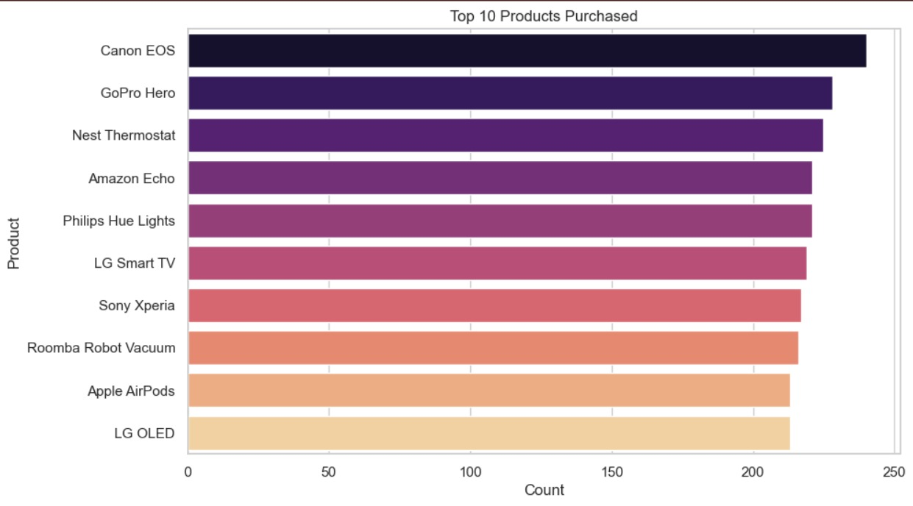
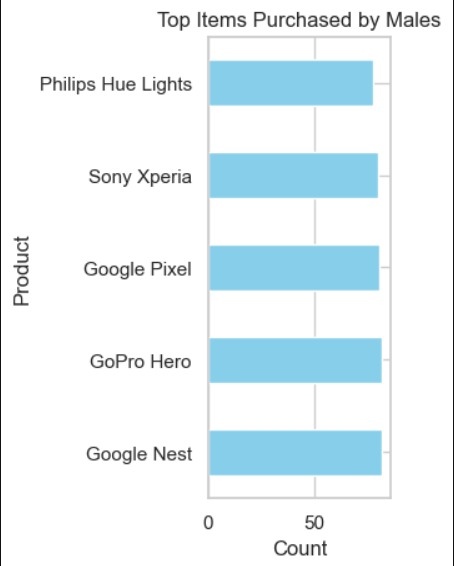
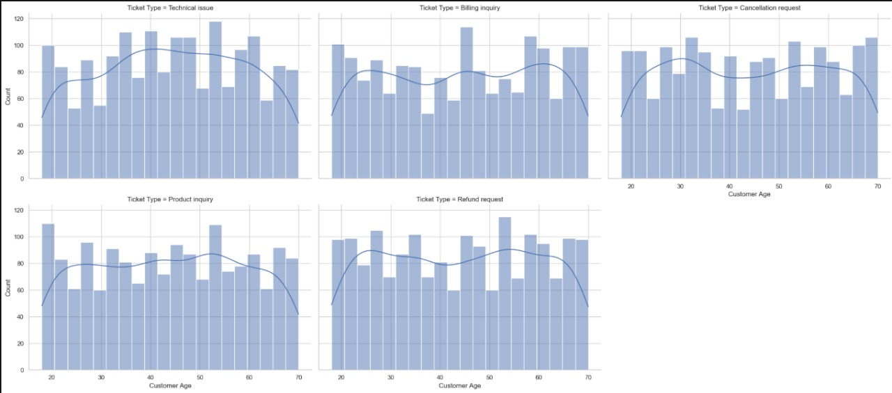

📌 **Customer\_Satisfaction\_Prediction\_Model**

📄 **Project Overview**

This project is designed to **predict customer satisfaction** by analyzing historical service and behavioral data. It applies supervised **machine learning algorithms** to model customer sentiment and classify satisfaction levels. The model helps in understanding key factors affecting customer experience and supports proactive service improvements. It utilizes tools like Python, Pandas, NumPy, Seaborn, Matplotlib, and Scikit-learn for data preprocessing, EDA, and machine learning model development.

---

🎯 **Objectives**

* Identify key features influencing customer satisfaction
* Build a predictive model to classify satisfied vs. unsatisfied customers
* Evaluate model performance using classification metrics

---

📊 **Tools & Technologies**

* **Programming Language**: Python
* **Libraries Used**:

  * `Pandas`, `NumPy` – Data handling & preprocessing
  * `Matplotlib`, `Seaborn` – Exploratory Data Analysis & visualization
  * `Scikit-learn` – Model training, evaluation, and feature scaling
  * `RandomForestClassifier` – Final machine learning algorithm used

---

🧠 **Key Steps in the Project**

* Loaded and cleaned the dataset
* Handled missing values and encoded categorical features
* Performed exploratory data analysis (EDA)
* Scaled features using `StandardScaler`
* Trained and evaluated a **Random Forest Classifier**
* Analyzed accuracy, confusion matrix, and classification report

---

✅ **Results**

The model achieved strong classification performance, with clear identification of patterns between customer interaction attributes and satisfaction. The results can guide service enhancements and targeted customer engagement strategies.

---

### 📁 **Files in Repository**

* `cxsentimentanalysis.ipynb`: Jupyter notebook with full workflow
* `customer_support_tickets.csv`: Dataset used (if you include it)
* `README.md`: Project overview and usage guide

---
Insight Graphs




🚀 *Steps How to Run**

1. Clone the repository 
2. Install dependencies:

   ```bash
   pip install pandas numpy matplotlib seaborn scikit-learn
   ```
3. Run the notebook:

   ```bash
   jupyter notebook cxsentimentanalysis.ipynb
   ```

---

🔗 **Future Improvements** (Awaited)

* Hyperparameter tuning
* Try other ML algorithms (Logistic Regression, XGBoost)
* Deploy the model with Flask or Streamlit

---
